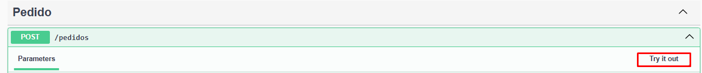
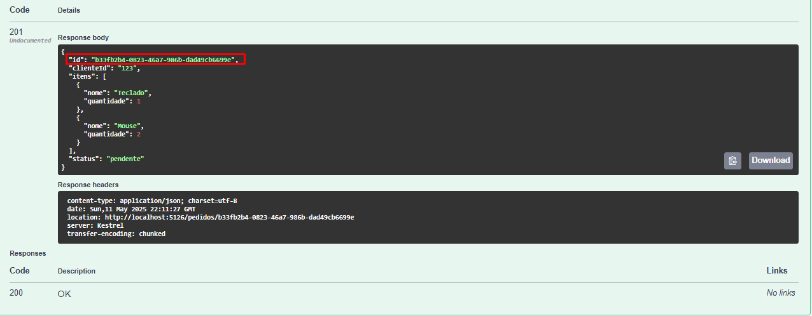
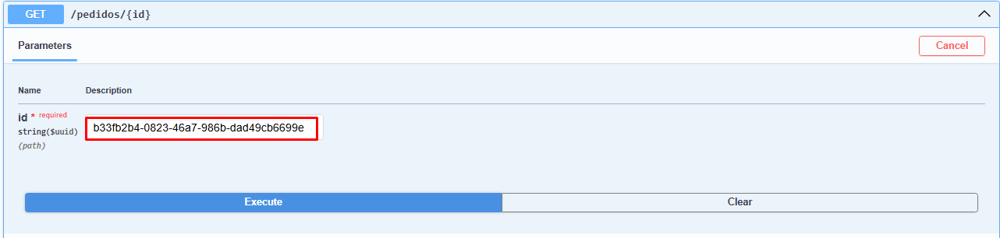
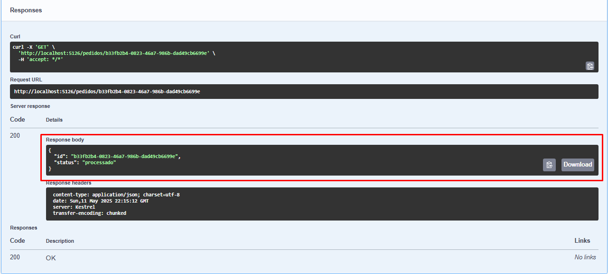

# Desafio Técnico BTG - Processamento Assíncrono de Pedidos

Este projeto foi desenvolvido como parte do desafio técnico proposto pelo BTG Pactual. O objetivo é simular o processamento assíncrono de pedidos utilizando uma API HTTP, filas de mensagens e armazenamento em memória.

---

## Sobre o projeto

A aplicação expõe dois endpoints principais:

- `POST /pedidos`: cria um novo pedido e o envia para uma fila para processamento assíncrono.
- `GET /pedidos/{id}`: retorna o status atual de um pedido específico.

Ao criar um pedido, ele é marcado como "pendente" e enviado para a fila. Um consumidor então processa esse pedido com um pequeno delay (simulando trabalho assíncrono), e marca o pedido como "processado". O status é mantido em memória durante a execução do sistema.

---

## Arquitetura

- API construída em .NET 8 (Web API)
- Processamento assíncrono via RabbitMQ e MassTransit
- Armazenamento dos pedidos em memória com `ConcurrentDictionary`
- Estrutura separada em camadas: Controllers, Services, Consumers, Models
- Testes unitários com xUnit

## Tecnologias utilizadas

- .NET 8
- RabbitMQ
- MassTransit
- Docker e Docker Compose
- Swagger

---

## Requisitos para rodar

- [.NET SDK 8](https://dotnet.microsoft.com/en-us/download)
- [Docker Desktop](https://www.docker.com/products/docker-desktop)
- Visual Studio Code (opcional)
  - Extensões recomendadas:
    - C#
    - .NET Install Tool
---

## Como executar o projeto (Via Terminal)

1. Clone este repositório:
   ```
   git clone <URL_DO_REPOSITORIO>
   cd PedidoProcessor
   ```

2. Suba o RabbitMQ com Docker:
   ```
   docker compose up -d
   ```

3. Execute a aplicação:
   ```
   dotnet run
   ```

4. Acesse a documentação da API:
   ```
   http://localhost:5126/swagger
   ```

---

## Exemplo de uso

### Criar um pedido 

Requisição: `POST /pedidos`  


Corpo da requisição:

```json
{
  "clienteId": "123",
  "itens": [
    { "nome": "Teclado", "quantidade": 1 },
    { "nome": "Mouse", "quantidade": 2 }
  ]
}
```

- O endpoint realiza validações para garantir que o `clienteId` não esteja vazio e que exista ao menos um item.

Resposta:
- Status HTTP: `201 Created`
- Corpo: ID do pedido e status "pendente"



### Consultar o status

Requisição: `GET /pedidos/{id}`



- Status possível: `"pendente"` ou `"processado"`
- Após 10 segundos da criação, o pedido muda para `"processado"`
- Caso o ID não exista, retorna `404 Not Found`



---

## Testes unitários

O projeto possui um projeto de testes separado, localizado em `PedidoProcessor.Tests/`.

### Executar os testes:

```bash
cd PedidoProcessor.Tests
dotnet test
```

Os testes cobrem a lógica da camada de serviço (`PedidoService`) e verificam:
- Criação de pedidos com status `"pendente"`
- Atualização de status para `"processado"`

---

## Observações

- Os dados são mantidos em memória durante a execução da aplicação. Ao encerrar, tudo é perdido.
- O uso do RabbitMQ é essencial para o funcionamento. Certifique-se de que o container esteja ativo.
- O tempo de processamento é configurável na classe `PedidoConsumer`.
- A aplicação possui logs simples no console indicando o recebimento e o processamento dos pedidos.

---

Desenvolvido para o processo seletivo de Engenheiro de Software (.NET)| Electronic Trading do BTG Pactual.